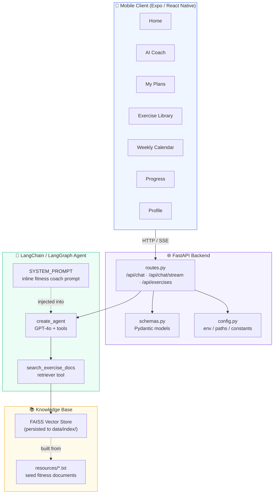
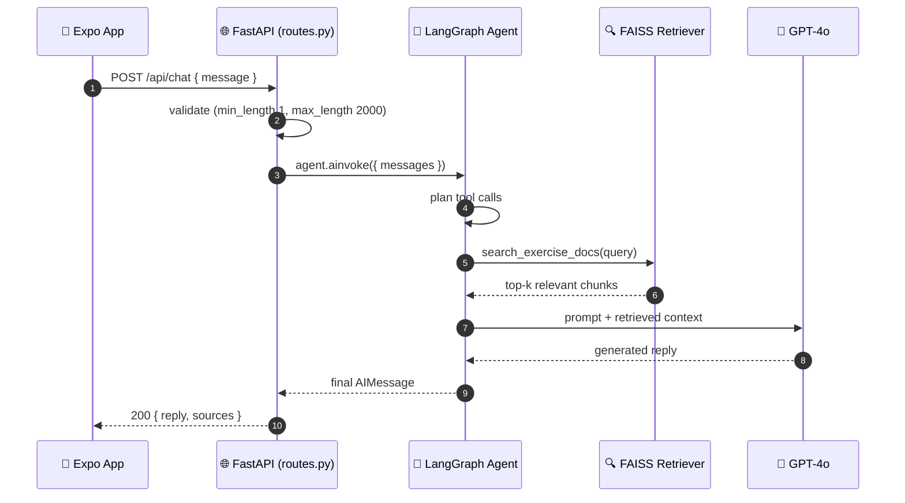
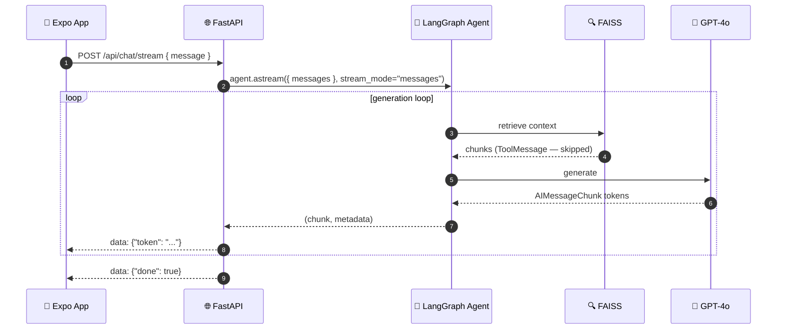
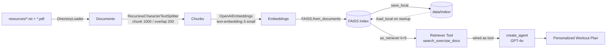
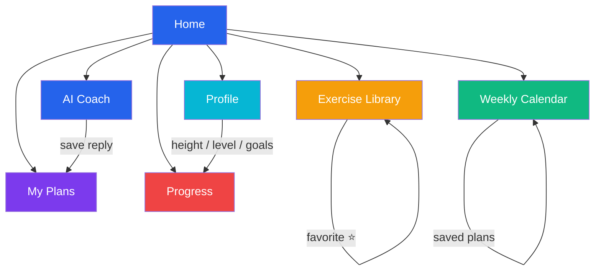

# Workout Routine Agent

An AI-powered personal training assistant that generates **tailored workout routines** from your fitness notes, exercise-science research, YouTube transcripts, and web articles.

This is a **full-stack** workout assistant built as:

- A **FastAPI backend** exposing a RAG agent over REST + SSE
- A **React Native mobile app (Expo)** with a rich feature set
- **Persistent FAISS** retrieval (no rebuild on every start)
- **Full documentation** (English) and **offline-runnable tests**

> ⚠️ **Disclaimer**: This project is a technical demonstration and educational reference. Workout suggestions are general guidance and do **not** replace professional medical or fitness advice. Consult a qualified professional before starting any new exercise program, especially if you have pre-existing conditions.

---

## Table of Contents

- [Features](#-features)
- [Architecture](#-architecture)
- [How It Works](#-how-it-works)
- [Request Flow (Sequence)](#-request-flow-sequence)
- [Streaming (SSE) Flow](#-streaming-sse-flow)
- [RAG Pipeline (Data Flow)](#-rag-pipeline-data-flow)
- [App Navigation Map](#-app-navigation-map)
- [Repository Layout](#-repository-layout)
- [Quick Start — Backend](#-quick-start--backend)
- [Quick Start — Mobile App](#-quick-start--mobile-app)
- [API Overview](#-api-overview)
- [Tests](#-tests)
- [Configuration](#-configuration)
- [Customization](#-customization)
- [Roadmap](#-roadmap)
- [License](#-license)

---

## ✨ Features

**Backend**

- RAG-powered agent (LangChain 1.x + LangGraph) with GPT-4o
- `POST /api/chat` (full response) and `POST /api/chat/stream` (SSE tokens)
- `GET /api/exercises` + `GET /api/exercises/search` — built-in exercise library
- FAISS index **persisted to disk** (`save_local` / `load_local`) — no rebuild on restart
- Inline system prompt (no `hub.pull` runtime network dependency)
- The interactive CLI is preserved (`python -m app.scripts.cli`)
- 24 pytest tests, fully offline (mocked LLM)

**Mobile App (Expo / React Native)**

- **AI Coach** — chat with the agent, streaming responses
- **My Plans** — save, view, and manage generated plans
- **Exercise Library** — browse by muscle group, search, favorite exercises
- **Weekly Calendar** — pure-JS week view + suggested 5-day split
- **Progress** — workout check-ins, activity log, body metrics (weight / BMI)
- **Profile** — fitness level, goals, equipment, height (for BMI), notes
- Local persistence via AsyncStorage (works offline once running)

---

## 🏗️ Architecture

### System Overview



### Component Responsibilities

| Layer | Module | Responsibility |
|---|---|---|
| **Mobile** | `app/app/*.tsx` | 7 expo-router screens, chat UI, forms, local state |
| **Mobile** | `app/src/api/client.ts` | HTTP client with SSE streaming support |
| **Mobile** | `app/src/store/storage.ts` | AsyncStorage persistence (profile, check-ins, favorites, metrics, plans) |
| **API** | `app/routes.py` | REST + SSE endpoints, exercise library, error handling |
| **Agent** | `app/agent.py` | RAG pipeline + LangGraph agent factory |
| **Schemas** | `app/schemas.py` | Pydantic models (mirrored in TS) |
| **Config** | `app/config.py` | Centralized env vars and tuning constants |

The **data contract** is kept in sync between `backend/app/schemas.py` and `app/src/types/index.ts` — the mobile client and backend share one set of types.

---

## 🧠 How It Works

1. **Load** — `agent.py` loads PDF/TXT files from `data/resources/` (`DirectoryLoader`).
2. **Split** — `RecursiveCharacterTextSplitter` (chunk 1000, overlap 200).
3. **Embed & index** — `OpenAIEmbeddings(text-embedding-3-small)` → FAISS vector store.
4. **Persist** — the index is saved with `save_local` and reused via `load_local`.
5. **Agent** — `create_agent` (LangGraph) wires the retriever tool + an inline system prompt to a `gpt-4o` model.
6. **Serve** — FastAPI exposes `invoke` (full) and `astream` (SSE) to the app.

---

## 📨 Request Flow (Sequence)

A full (non-streaming) chat request:



---

## 📡 Streaming (SSE) Flow

`POST /api/chat/stream` returns tokens incrementally using `stream_mode="messages"` — only AI message chunks are forwarded, so retrieved document text (tool output) is never leaked to the client.



> ⚠️ The client uses `fetch` + `ReadableStream` (an `EventSource` cannot send a POST body). The buffer splits `data:` frames across network chunks safely.

---

## 🧬 RAG Pipeline (Data Flow)



> **Persistence**: the index is only rebuilt when `data/index/` is missing. Delete that folder to force a rebuild after changing the knowledge base.

---

## 🧭 App Navigation Map



| Screen | Route | Features |
|---|---|---|
| Home | `/` | Feature menu / navigation hub, brand hero |
| AI Coach | `/chat` | Streamed chat with the agent; save the last reply as a plan |
| My Plans | `/plan` | List, view saved plans |
| Exercise Library | `/exercises` | Browse, search by muscle/name, favorite exercises |
| Weekly Calendar | `/calendar` | Pure-JS week view + suggested 5-day split |
| Progress | `/progress` | Workout check-ins, activity log, body metrics (weight/BMI) |
| Profile | `/profile` | Fitness level, goals, equipment, height, notes |

---

## 📁 Repository Layout

```
workout-routine-agent/
├── backend/
│   ├── app/
│   │   ├── __init__.py
│   │   ├── main.py           # FastAPI entry point (CORS, routers)
│   │   ├── config.py         # env / paths / constants
│   │   ├── agent.py          # RAG core: load → split → embed → FAISS → agent
│   │   ├── schemas.py        # Pydantic models (mirrored in the app)
│   │   ├── routes.py         # /api/chat, /api/chat/stream, /api/exercises
│   │   └── scripts/cli.py    # interactive CLI (same agent, no HTTP)
│   ├── data/
│   │   ├── resources/        # seed fitness documents (.txt)
│   │   └── index/            # persisted FAISS index (gitignored)
│   ├── tests/                # 24 pytest tests (offline)
│   ├── requirements.txt
│   └── pytest.ini
├── app/                       # Expo React Native app
│   ├── app/                   # expo-router screens
│   │   ├── _layout.tsx
│   │   ├── index.tsx          # Home
│   │   ├── chat.tsx           # AI Coach
│   │   ├── plan.tsx           # My Plans
│   │   ├── exercises.tsx      # Exercise Library
│   │   ├── calendar.tsx       # Weekly Calendar
│   │   ├── progress.tsx       # Progress & check-ins
│   │   └── profile.tsx        # Profile
│   └── src/
│       ├── api/client.ts      # backend HTTP client (incl. SSE)
│       ├── store/storage.ts   # AsyncStorage persistence
│       ├── types/index.ts     # TS types (mirror of schemas.py)
│       └── components/ui.tsx  # shared UI primitives (Screen, Card, Pill, Logo)
├── docs/
│   ├── ARCHITECTURE.md
│   ├── API.md
│   └── APP.md
├── README.md
└── .gitignore
```

---

## 🚀 Quick Start — Backend

### Prerequisites

- Python 3.12+ (tested on 3.14; 3.12 also available)
- An [OpenAI API key](https://platform.openai.com/api-keys)

### 1. Create a virtual environment and install

```bash
cd backend
python -m venv .venv
# Windows: .venv\Scripts\activate    |    macOS/Linux: source .venv/bin/activate
pip install -r requirements.txt
```

### 2. Set your API key

```bash
# Windows (PowerShell)
$env:OPENAI_API_KEY="your-key-here"
# macOS / Linux
export OPENAI_API_KEY="your-key-here"
```

### 3. Run the API server

```bash
uvicorn app.main:app --reload --port 8000
```

- Swagger UI: http://localhost:8000/docs
- Health check: http://localhost:8000/api/health

> On first start, the server builds the FAISS index from `data/resources/` and persists it to `data/index/`. Subsequent starts load it from disk (much faster).

### 4. (Alternative) Run the interactive CLI

```bash
cd backend
python -m app.scripts.cli
```

### 5. Smoke test

```bash
curl -s http://localhost:8000/api/health
curl -s http://localhost:8000/api/exercises | head
```

---

## 🚀 Quick Start — Mobile App

### Prerequisites

- Node.js 18+
- npm

### 1. Install dependencies

```bash
cd app
npm install
```

### 2. Point the app at your backend

Create a `.env` file in the `app/` directory (or export the variable):

```bash
EXPO_PUBLIC_API_URL=http://localhost:8000/api
```

> If unset, the app defaults to `http://localhost:8000/api`. For a physical device, use your computer's LAN IP instead of `localhost`.

### 3. Run

```bash
npm run web      # Expo web (works without Android SDK)
# or
npm start        # Expo Go on your phone / emulator
```

Open the printed URL (e.g. http://localhost:8081).

> **Web-only verification note**: This repository was developed and verified on **Expo web** (no Android SDK available). iOS/Android builds use only pure-JS components and should work, but were not tested on real devices.

---

## 🔌 API Overview

| Method | Path | Description |
|---|---|---|
| `GET` | `/api/health` | Health check |
| `POST` | `/api/chat` | Non-streaming agent response `{ reply }` |
| `POST` | `/api/chat/stream` | SSE token stream |
| `GET` | `/api/exercises` | Full exercise library |
| `GET` | `/api/exercises/search?q=` | Filter exercises |

Request body for chat: `{ "message": "Give me a 10-minute core workout" }`.

See [docs/API.md](docs/API.md) for full examples, including SSE frame formats and error codes.

---

## 🧪 Tests

```bash
cd backend
.venv/Scripts/python -m pytest -q
# 24 passed — fully offline (LLM & embeddings are mocked)
```

The app type-checks with:

```bash
cd app
npx tsc --noEmit
```

The SSE test (`test_chat_stream_yields_tokens_only`) verifies that retrieved document text (ToolMessage) is **never** forwarded to the client.

---

## ⚙️ Configuration

| Variable | Scope | Description |
|---|---|---|
| `OPENAI_API_KEY` | backend | OpenAI API key (required) |
| `MODEL_NAME` | backend | Chat model, default `gpt-4o` |
| `EMBEDDING_MODEL` | backend | Embedding model, default `text-embedding-3-small` |
| `EXPO_PUBLIC_API_URL` | app | Backend base URL, default `http://localhost:8000/api` |

Tuning constants in `app/config.py`: `CHUNK_SIZE` (1000), `CHUNK_OVERLAP` (200), `RETRIEVER_K` (5).

---

## 🛠️ Customization

- **Model**: set `MODEL_NAME` env var or edit `app/agent.py`.
- **Retrieval**: adjust `CHUNK_SIZE` / `CHUNK_OVERLAP` / `RETRIEVER_K` in `app/config.py`.
- **Knowledge base**: add your own `.txt` / `.pdf` files to `backend/data/resources/`, then **delete `backend/data/index/`** so it rebuilds.
- **Exercise library**: edit `EXERCISE_LIBRARY` in `app/routes.py`.
- **System prompt**: edit `SYSTEM_PROMPT` in `app/agent.py`.

---

## 🗺️ Roadmap

- [ ] Backend persistence for plans / check-ins (currently stored on-device)
- [ ] User authentication
- [ ] Voice input & workout timers
- [ ] Image-based form check (vision model)
- [ ] Real-device iOS / Android verification

---

## 📄 License

MIT

## 🙏 Acknowledgements

- [LangChain](https://python.langchain.com/) · [LangGraph](https://langchain-ai.github.io/langgraph/) · [FastAPI](https://fastapi.tiangolo.com/) · [Expo](https://expo.dev/)
