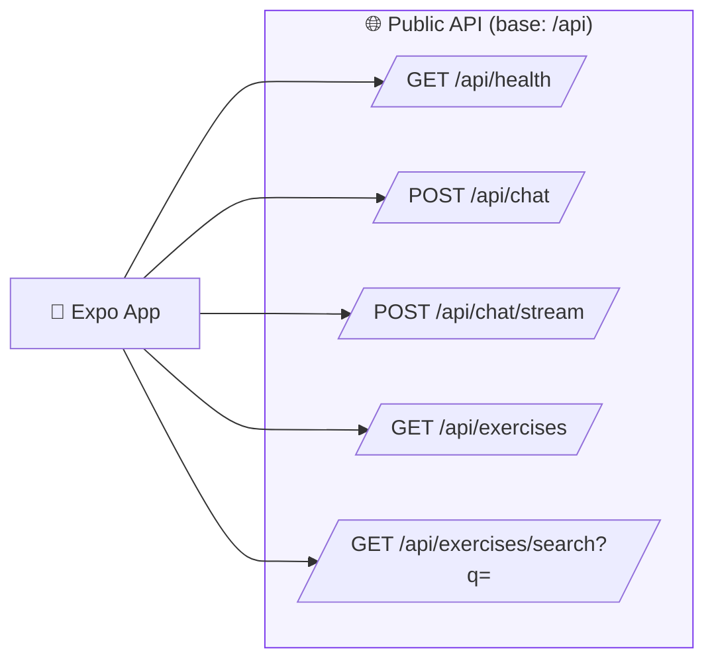
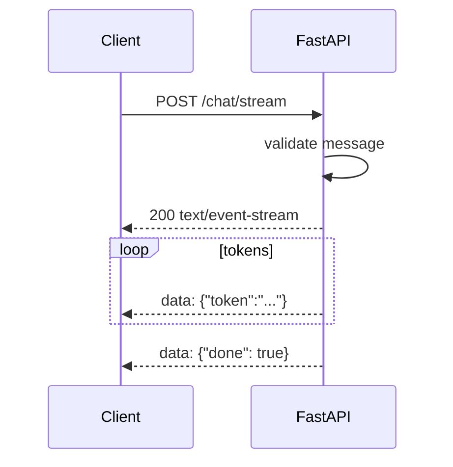

# API Reference

Base URL: `http://localhost:8000` (configurable via `EXPO_PUBLIC_API_URL` in the app).

Interactive docs: http://localhost:8000/docs (Swagger UI).

---

## Endpoint Map



---

## GET `/api/health`

Health check. Returns a simple status object; used by the app to show backend connectivity.

**Response**

```json
{ "status": "healthy" }
```

---

## POST `/api/chat`

Send a message to the workout agent and receive a full (non-streaming) reply.

**Request body**

```json
{ "message": "Give me a 10-minute core workout" }
```

With memory:

```json
{
  "message": "Give me a 10-minute core workout",
  "session_id": "sess-...",
  "user_id": "user-...",
  "history": [
    { "role": "user", "content": "I want to build core strength" },
    { "role": "assistant", "content": "Great, core strength..." }
  ],
  "profile": { "goals": ["strength"], "constraints": ["bad knees"] }
}
```

| Field | Type | Notes |
|---|---|---|
| `message` | string | required, 1–2000 characters |
| `session_id` | string? | thread-scoped short-term memory |
| `user_id` | string? | cross-thread long-term + vector memory |
| `history` | array? | conversation so far (single source of truth for short-term context) |
| `profile` | object? | user profile facts (long-term memory) |

**Responses**

- `200`:

```json
{
  "reply": "Here is a 10-minute core workout...",
  "sources": []
}
```

- `422` — empty message or message > 2000 chars (schema validation).
- `502` — missing `OPENAI_API_KEY` or agent error (generic message, no internal detail leaked).

---

## POST `/api/chat/stream`

Stream the agent's reply as Server-Sent Events. The mobile app consumes this
with `fetch` + `ReadableStream` (SSE via POST, since `EventSource` only supports GET).

**Request body** — same as `/api/chat`.

**Response** — `text/event-stream`:

```
data: {"token": "Here"}

data: {"token": " is"}

data: {"token": " your plan"}

data: {"done": true}

```

| Frame | Meaning |
|---|---|
| `{"token": "..."}` | A piece of generated AI text |
| `{"error": "..."}` | Streaming error (e.g. init failure) |
| `{"done": true}` | Stream complete |

> **Note**: Only `AIMessageChunk` text is streamed. Tool output (retrieved document text) is never sent to the client.

**Streaming sequence**



---

## GET `/api/exercises`

Return the full built-in exercise library (8 seed exercises).

**Response**

```json
{
  "total": 8,
  "exercises": [
    {
      "name": "Plank",
      "muscle_group": "Core",
      "equipment": "None",
      "difficulty": "beginner",
      "instructions": ["Forearms on floor, body straight.", "Brace core and hold."]
    }
  ]
}
```

| Field | Type | Values |
|---|---|---|
| `difficulty` | string | `beginner` · `intermediate` · `advanced` |
| `equipment` | string | `None` (bodyweight) or equipment name |

---

## GET `/api/exercises/search?q=<query>`

Filter the exercise library by name or muscle group.

**Example**

```
GET /api/exercises/search?q=core
```

**Response** — same shape as `/api/exercises`, with only matching items. Empty
query returns the full library.

**Examples**

| Query | Result |
|---|---|
| `q=core` | Plank, Dead Bug, Pallof Press |
| `q=leg` | Bodyweight Squat, Goblet Squat |
| `q=zzz` | `{ "total": 0, "exercises": [] }` |

---

## Error Handling

| Status | Cause |
|---|---|
| `422` | Validation error (empty / too-long message) |
| `500` | Agent initialization failed (missing `OPENAI_API_KEY`, etc.) |
| `502` | Agent/LLM request failed |

All error responses use a generic message; internal exception details are logged server-side only.
