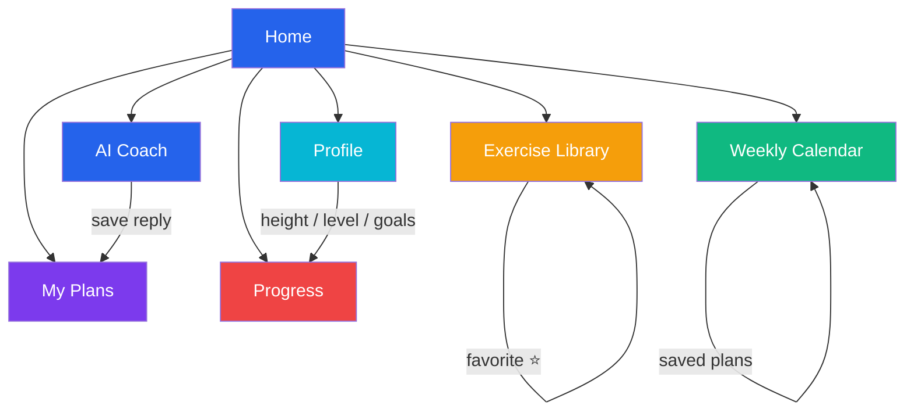
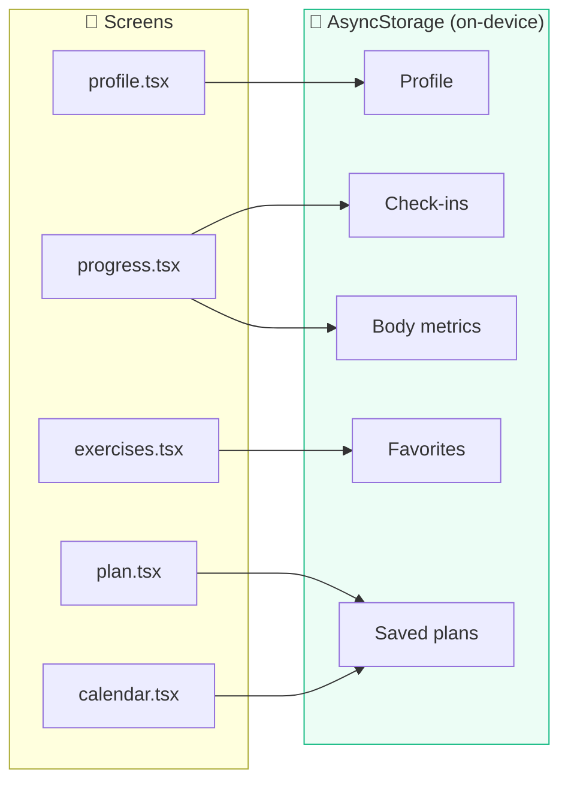
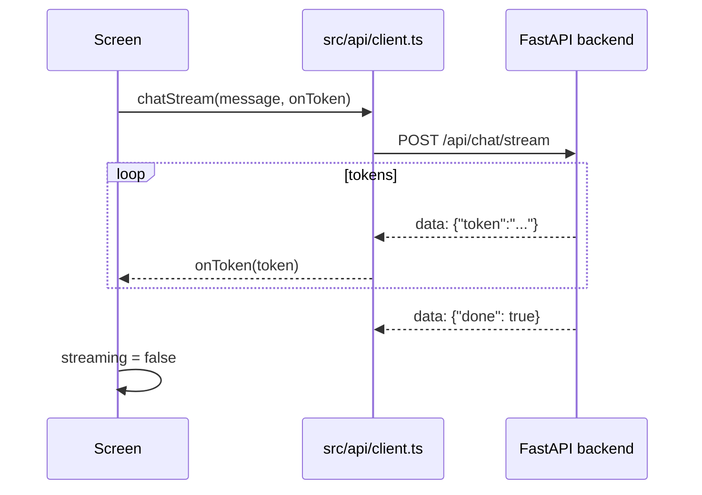

# Mobile App Guide

The mobile app is a **React Native** application built with **Expo** and **expo-router**.

> **Verification note**: developed and verified on **Expo web**. iOS/Android builds use only pure-JS components and should work, but were not tested on real devices (no Android SDK / macOS available).

---

## Navigation Map



## Screens

| Route | Screen | Features |
|---|---|---|
| `/` | Home | Feature menu / navigation hub, brand hero, disclaimer banner |
| `/chat` | AI Coach | Streamed chat with the agent; save the last reply as a plan |
| `/plan` | My Plans | List, view saved plans |
| `/exercises` | Exercise Library | Browse, search by muscle/name, favorite exercises |
| `/calendar` | Weekly Calendar | Pure-JS week view + suggested 5-day split |
| `/progress` | Progress | Workout check-ins, activity log, body metrics (weight/BMI) |
| `/profile` | Profile | Fitness level, goals, equipment, height (BMI), notes |

## Data Layer

All user data is persisted **on-device** with `@react-native-async-storage/async-storage`
(`src/store/storage.ts`):

- Profile
- Workout check-ins
- Favorite exercises
- Body metrics
- Saved plans

This means the app is fully functional even if the backend is temporarily offline
for the local features (Plans, Exercises, Calendar, Progress, Profile). Only the
AI Coach screen requires the backend.



## Networking

`src/api/client.ts` talks to the backend:

- Base URL: `EXPO_PUBLIC_API_URL` env var, default `http://localhost:8000/api`.
- Streaming chat uses `fetch` + `ReadableStream` to consume SSE (`POST` — `EventSource`
  only supports `GET`).



## Running

```bash
cd app
npm install
EXPO_PUBLIC_API_URL=http://localhost:8000/api npm run web
```

For a physical phone with Expo Go, replace `localhost` with your computer's LAN IP.

## Adding a Screen

1. Add a route file under `app/` (e.g. `app/timer.tsx`).
2. Import shared UI from `../src/components/ui`.
3. Add a menu entry on the Home screen (`app/index.tsx`).

## Type Safety

Edit `src/types/index.ts` when backend schemas change — it mirrors
`backend/app/schemas.py`.
