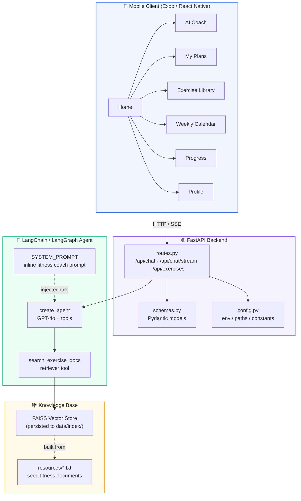
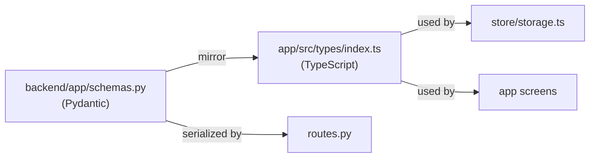
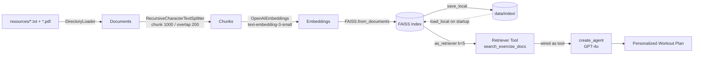
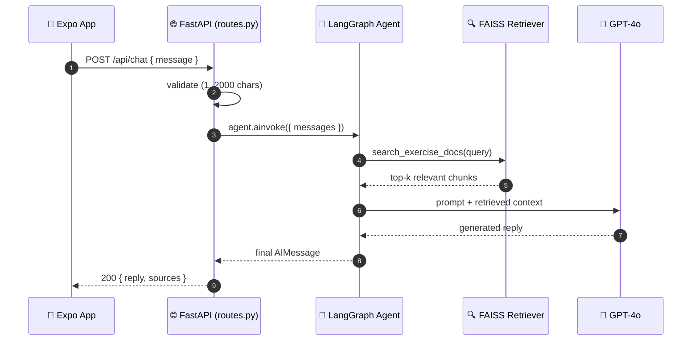
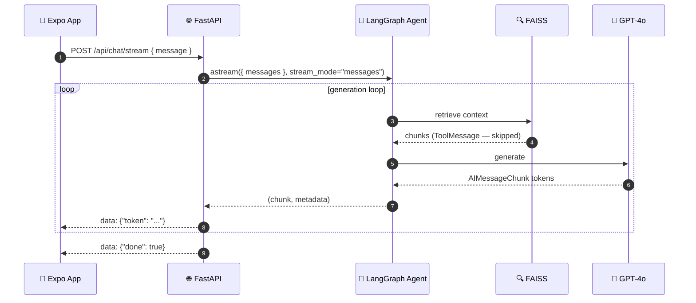

# Architecture

## Overview

The Workout Routine Agent is a full-stack RAG (Retrieval-Augmented Generation) application with four layers: a React Native mobile client, a FastAPI API layer, a LangChain/LangGraph agent, and a persisted FAISS knowledge base.

## System Overview

## Components

### 1. Backend (`backend/app/`)

| Module | Responsibility |
|---|---|
| `main.py` | FastAPI app, CORS, router mounting |
| `config.py` | Centralized env vars, paths, and tuning constants |
| `agent.py` | The RAG pipeline and the LangGraph agent factory |
| `schemas.py` | Pydantic request/response models |
| `routes.py` | `/api/*` HTTP endpoints |
| `scripts/cli.py` | Standalone interactive CLI using the same agent |

### 2. Mobile app (`app/`)

| Area | Responsibility |
|---|---|
| `app/` (expo-router screens) | Home, Chat, Plans, Exercises, Calendar, Progress, Profile |
| `src/api/client.ts` | HTTP client with SSE streaming support |
| `src/store/storage.ts` | AsyncStorage persistence (profile, check-ins, favorites, metrics, plans) |
| `src/types/index.ts` | TypeScript types mirroring `schemas.py` |
| `src/components/ui.tsx` | Shared UI primitives (Screen, Card, Pill, Logo, theme) |

## Data Contract

`backend/app/schemas.py` and `app/src/types/index.ts` define the **same** types:

- `ChatRequest` / `ChatResponse`
- `Exercise` / `ExerciseLibrary`
- `WorkoutItem` / `WorkoutPlan`
- `Profile`
- `BodyMetric`
- `CheckIn`
- `WeeklyPlan`

Keeping them in sync is the contract between backend and app.

## RAG Pipeline

1. **Load** — `load_documents()` reads all `.pdf` / `.txt` under `backend/data/resources/`.
2. **Split** — `RecursiveCharacterTextSplitter`, chunk size 1000 / overlap 200.
3. **Embed** — `OpenAIEmbeddings(text-embedding-3-small)`.
4. **Index** — `FAISS.from_documents(...)`.
5. **Persist** — `save_local()` to `backend/data/index/`; on startup `load_local()` reuses it, skipping the expensive rebuild.
6. **Agent** — `create_agent(model, tools=[retriever_tool], system_prompt=...)` returns a LangGraph `CompiledStateGraph` supporting `invoke` / `astream`.

## Request Flow (Non-Streaming)

## Streaming (SSE)

- Backend: `POST /api/chat/stream` → `StreamingResponse` yielding `data: {token}` frames from `agent.astream()`.
- App: `fetch` + `ReadableStream` (an `EventSource` cannot POST), buffering split lines and parsing `data:` frames.

> **Security note**: `stream_mode="messages"` + an `AIMessageChunk` guard ensure that retrieved document text (ToolMessage content) is **never** forwarded to the client. The test `test_chat_stream_yields_tokens_only` verifies this.

## Persistence Strategy

- **Backend**: FAISS index persisted to disk; rebuild only when `data/index/` is missing.
- **App**: user data (profile, check-ins, favorites, metrics, saved plans) lives on-device in AsyncStorage. No backend database is required for the demo.

## Performance: Agent Singleton

The agent (FAISS load + graph compile) is built **once** and cached module-level in `routes.py`. Subsequent requests reuse the same compiled graph — LangGraph compiled graphs are stateless and safe to share across concurrent requests.

## Design Decisions

| Decision | Rationale |
|---|---|
| Inline system prompt (no `hub.pull`) | Removes a runtime network dependency; keeps the agent offline-capable and unit-testable |
| `create_agent` (LangGraph) instead of legacy `AgentExecutor` | LangChain 1.x API; returns a streamable compiled graph |
| FAISS persistence | Avoids re-embedding the knowledge base on every server start |
| `stream_mode="messages"` for SSE | Token-level increments; prevents leaking retrieved documents |
| Agent singleton cache | Avoids rebuilding the graph on every request |
| Expo web for verification | No Android SDK available; pure-JS components keep web and native compatible |
| Pydantic ↔ TS mirror | Single data contract, reduced drift between backend and app |
